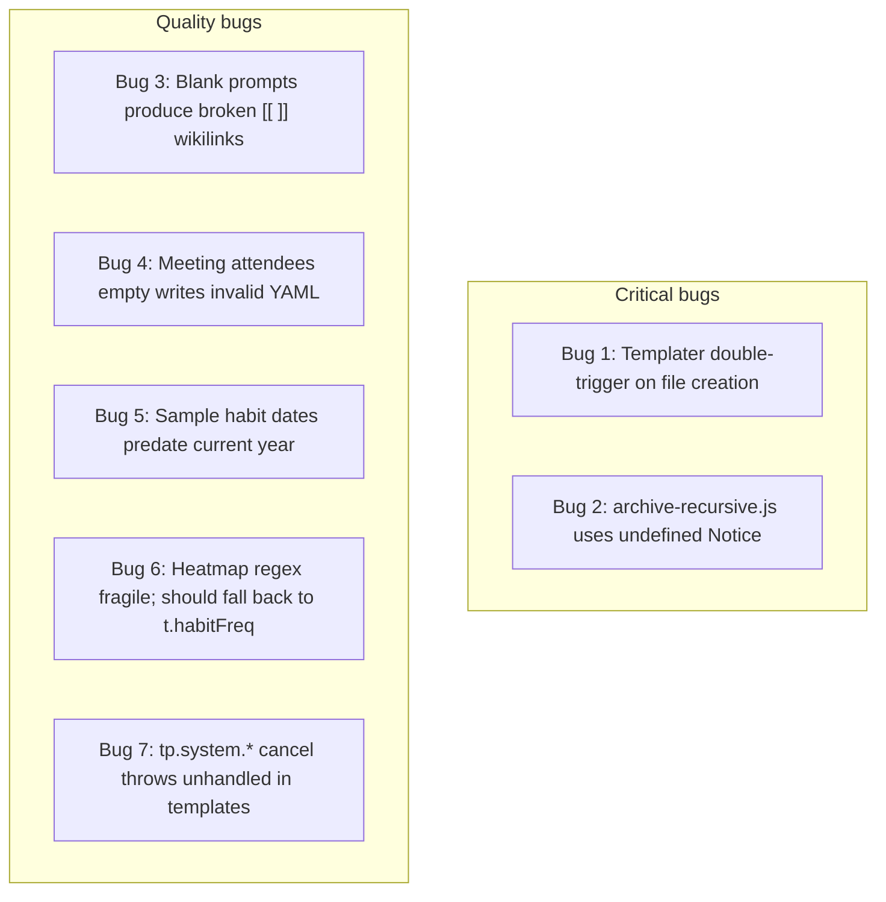

## Findings



## Bug-by-bug

### Bug 1 (CRITICAL) — Templater double-trigger breaks Feature 1

File: [.obsidian/plugins/templater-obsidian/data.json](.obsidian/plugins/templater-obsidian/data.json)

Current content has both `trigger_on_file_creation: true` and a `folder_templates` array that maps `1-projects`, `2-areas`, `3-resources`, `5-notes` to specific templates. When QuickAdd creates a file in any of those folders, Obsidian fires `vault.create`. Templater's create handler then ALSO runs the folder template against that already-templated file — re-prompting the user for status/priority and prepending a second YAML block, or aborting the file with an error notice.

QuickAdd cannot suppress Templater's independent folder-template handler — its only Templater integration is the in-render `tp.*` execution.

Fix — remove the `folder_templates` array (QuickAdd commands now own template selection):

```json
{
  "template_folder": "_templates",
  "auto_jump_to_cursor": true,
  "trigger_on_file_creation": true,
  "folder_templates": []
}
```

### Bug 2 (CRITICAL) — Missing Notice import in archive script

File: [_scripts/archive-recursive.js](_scripts/archive-recursive.js)

Lines 5-6, 11-12, 45, 73 call `new Notice(...)`. `Notice` is not in `params` and not a global in QuickAdd user-script context. Calling Archive (recursive) currently throws `ReferenceError: Notice is not defined` at the first early-exit.

Fix — restore the import at the top of the function body:

```javascript
module.exports = async (params) => {
  const { app, quickAddApi } = params;
  const { Notice } = require("obsidian");
  // ... rest unchanged
};
```

### Bug 3 (QUALITY) — Blank prompts produce broken wikilinks

Files: [_templates/tpl-project.md](_templates/tpl-project.md), [_templates/tpl-task-note.md](_templates/tpl-task-note.md), [_templates/tpl-goal.md](_templates/tpl-goal.md), [_templates/tpl-meeting.md](_templates/tpl-meeting.md)

When the user presses Enter on a blank goal/area/project prompt, the rendered YAML becomes:

```yaml
goal: "[[]]"
area: "[[]]"
```

These are unresolved wikilinks — every new note then shows up in the [Habits Dashboard](5-notes/Habits Dashboard.md) "Unresolved frontmatter links" query, drowning the signal.

Fix pattern — emit the field with or without the brackets depending on input. Example for `tpl-project.md`:

```markdown
<%*
// ... existing prompts ...
const goalLine = goalLink ? `goal: "[[${goalLink}]]"` : `goal: `;
const areaLine = areaLink ? `area: "[[${areaLink}]]"` : `area: `;
const deadlineLine = deadline ? `deadline: ${deadline}` : `deadline: `;
-%>
---
type: project
status: <% status %>
priority: <% priority %>
<% goalLine %>
<% areaLine %>
<% deadlineLine %>
completed_date: 
tags: []
created: <% tp.date.now("YYYY-MM-DD") %>
---
```

Apply the analogous pattern to:
- `tpl-task-note.md`: `project`, `area`, `due`
- `tpl-goal.md`: `area`, `target_date`
- `tpl-meeting.md`: `project`, `location`

### Bug 4 (QUALITY) — Meeting attendees empty writes weird YAML

File: [_templates/tpl-meeting.md](_templates/tpl-meeting.md) lines 13-15

When `attendeesRaw` is blank, the rendered frontmatter becomes:

```yaml
attendees:

project: "[[]]"
```

The blank line inside the YAML block parses as `attendees: null` and visually breaks the property pane.

Fix — default to a literal empty list when no attendees:

```markdown
<%*
const attendeesBlock = attendeesRaw
  ? `attendees:\n${attendeesRaw.split(",").map((a) => `  - "[[${a.trim()}]]"`).join("\n")}`
  : `attendees: []`;
-%>
---
type: meeting
scheduled: <% tp.date.now("YYYY-MM-DD") %>
<% locationLine %>
tags: [notes/meeting]
<% attendeesBlock %>
<% projectLine %>
created: <% tp.date.now("YYYY-MM-DD") %>
---
```

### Bug 5 (QUALITY) — Sample habit dates predate current year

File: [1-projects/Couch to 5K Training Program.md](1-projects/Couch to 5K Training Program.md) lines 49-53

Today is 2026-05-23. Heatmap Tracker defaults to the current calendar year; the 2025-01-* sample dates fall outside the visible range, so the heatmap renders empty on first open and looks broken.

Fix — refresh the sample dates to the past two weeks:

```markdown
## Sample Habits (heatmap test data)
- [x] Morning stretch [habitFreq:: daily] ✅ 2026-05-21
- [x] Morning stretch [habitFreq:: daily] ✅ 2026-05-22
- [x] Morning stretch [habitFreq:: daily] ✅ 2026-05-23
- [x] Weekly long run [habitFreq:: weekly] ✅ 2026-05-17
- [x] Monthly gear check [habitFreq:: monthly] ✅ 2026-05-01
```

Also dropped the 🔁 recurrence emoji — recurrence shouldn't apply to already-completed historical entries.

### Bug 6 (QUALITY) — Heatmap regex should fall back to t.habitFreq

File: [5-notes/Habits Dashboard.md](5-notes/Habits Dashboard.md) lines 24-27

Dataview exposes inline fields as direct properties on the task object (`t.habitFreq`). If the user ever moves the inline field somewhere the regex doesn't match (e.g., before the checkbox), or Dataview strips it from `t.text` in a future version, the heatmap goes blank. Prefer the structured field and fall back to regex.

Fix:

```javascript
const freqOf = (t) => {
  const raw = t.habitFreq ?? t["habit-freq"];
  if (typeof raw === "string") {
    const v = raw.toLowerCase();
    if (v === "daily" || v === "weekly" || v === "monthly") return v;
  }
  const m = t.text?.match(/\[habitFreq::\s*(daily|weekly|monthly)\]/i);
  return m ? m[1].toLowerCase() : null;
};
```

### Bug 7 (LOW) — tp.system.* cancel exits without diagnostic

Files: all 6 edited templates

If the user presses Escape on any prompt, Templater throws `CommandsCancelled`, QuickAdd notices it, and the empty file QuickAdd already created stays behind (since file creation precedes Templater rendering in QuickAdd's flow). Recovery: user manually deletes the empty file.

Fix — wrap the whole `<%* %>` block in try/catch and self-clean on cancel:

```markdown
<%*
try {
  const status = await tp.system.suggester(...);
  // ... all prompts ...
} catch (err) {
  await tp.file.find_tfile(tp.file.title).vault.delete(tp.file.find_tfile(tp.file.title));
  throw err;
}
-%>
```

This is a quality fix; defer if you'd rather keep templates simple.

## Implementation order

1. Apply Bug 1 fix first (single-line JSON change, unblocks Feature 1).
2. Apply Bug 2 fix (one-line script change, unblocks Feature 3).
3. Apply Bug 3 fix to the 4 link-bearing templates.
4. Apply Bug 4 fix to meeting template.
5. Apply Bug 5 fix to C25K project sample data.
6. Apply Bug 6 fix to dashboard.
7. Skip Bug 7 unless you want it.

## Verification (automated, after fixes)

```bash
node --check _scripts/archive-recursive.js
node -e "['.obsidian/plugins/quickadd/data.json','.obsidian/plugins/templater-obsidian/data.json','.obsidian/plugins/dataview/data.json','.obsidian/app.json'].forEach(f=>JSON.parse(require('fs').readFileSync(f,'utf8')))"
node -e "const fs=require('fs');const ids=JSON.parse(fs.readFileSync('.obsidian/plugins/quickadd/data.json','utf8')).choices.map(c=>c.id);if(new Set(ids).size!==ids.length)throw 'duplicate IDs';console.log('all IDs unique')"
node -e "const fs=require('fs');for(const t of require('fs').readdirSync('_templates')){const s=fs.readFileSync('_templates/'+t,'utf8');if(s.includes('[[]]'))console.log('LITERAL EMPTY WIKILINK in',t)}"
```

## Verification (manual, in Obsidian)

After restarting Obsidian:

1. Confirm QuickAdd and Heatmap Tracker show as enabled in Settings → Community plugins.
2. Open command palette, run "QuickAdd: New Project" with title `Test Project`, blank goal/area, status=ongoing, priority=high. Confirm the file lands in `1-projects/Test Project.md` with `goal: ` and `area: ` (no `[[]]`).
3. Confirm Templater did NOT fire a second time (no double prompt, no double frontmatter).
4. Run "QuickAdd: New Meeting" with blank attendees. Confirm `attendees: []` in frontmatter.
5. Run "QuickAdd: Archive (recursive)" on `2-areas/Run a 5K.md` — confirm checkbox list shows `1-projects/Couch to 5K Training Program.md` as dependent, then archives both under `4-archives/2-areas/` and `4-archives/1-projects/` with `status: canceled` (or `completed`).
6. Rename `4-archives/2-areas/Run a 5K.md` back to `2-areas/Run a 5K.md` (manual restore for test), confirm the project's `goal:` field updates automatically.
7. Open [5-notes/Habits Dashboard.md](5-notes/Habits Dashboard.md). Confirm the heatmap shows the refreshed sample data with three color bands.
8. Delete the test project and the restored files.

## Out of scope
- `5-notes/Untitled.md` is pre-existing junk; leave for user to clean.
- Heatmap Tracker year-vs-365-days nuance is acceptable as-is.
- Adding `daysToShow: 365` override to the dashboard can be a follow-up.