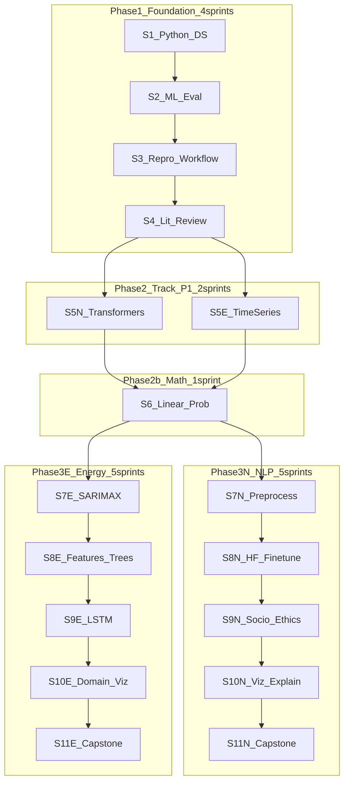

# Thesis Prerequisites Sprint Curriculum

Based on the [Thesis Prerequisites Map](file:///C:/Users/yuanw/Downloads/thesis_prerequisites_map.html):

| Priority | Meaning |
| -------- | ------- |
| **P1** | Thesis-blocking |
| **P2** | Defence-critical |
| **P3** | Strengthens framing |
| **P4** | Publishable polish |

> [!info] Pace & paths
> **Pace:** 2 weeks per sprint (~8–10 hrs/week).
>
> **Thesis path:** Do **Phase 1 + Phase 2 + one fork (Phase 3N or 3E) + one capstone** (~14 sprints, ~28 weeks).
>
> **Full "both tracks" path:** Do everything below (~22 sprints, ~44 weeks).

---

## Curriculum map

---

## Phase progress

- [ ] **Phase 1 — Foundation** (Sprints 1–4): Python DS, ML eval, reproducible workflow, mini lit review → [[Phase 1 — Foundation]]
- [ ] **Phase 2 — Track P1 + Math** (Sprints 5N, 5E, 6): Transformers, time series diagnostics, linear algebra/probability → [[Phase 2 — Track P1 and Math]]
- [ ] **Phase 3N — NLP track** (Sprints 7N–11N): Preprocessing, HF fine-tune, socio/ethics, viz/explain, NLP capstone → [[Phase 3N — NLP Track]]
- [ ] **Phase 3E — Energy track** (Sprints 7E–11E): SARIMAX, features/trees, LSTM, domain/DM/viz, energy capstone → [[Phase 3E — Energy Track]]
- [ ] **Choose thesis fork** after Sprint 6: commit to NLP *or* Energy for S7–S11; treat the other fork as optional depth

---

## Quick navigation

| Phase | Overview | Sprints |
| ----- | -------- | ------- |
| Phase 1 | [[Phase 1 — Foundation]] | [[Sprint 1 — Python for Data Science|S1]] → [[Sprint 2 — ML Fundamentals and Evaluation|S2]] → [[Sprint 3 — Git and Reproducible Workflow|S3]] → [[Sprint 4 — Academic Writing and Lit Review|S4]] |
| Phase 2 | [[Phase 2 — Track P1 and Math]] | [[Sprint 5N — Transformers and Attention|S5N]] · [[Sprint 5E — Time Series Foundations|S5E]] → [[Sprint 6 — Linear Algebra and Probability|S6]] |
| Phase 3N | [[Phase 3N — NLP Track]] | [[Sprint 7N — NLP Preprocessing Pipeline|S7N]] → [[Sprint 8N — HuggingFace Trainer and Imbalanced Metrics|S8N]] → [[Sprint 9N — Sociolinguistics and Research Ethics|S9N]] → [[Sprint 10N — Visualization and Explainability|S10N]] → [[Sprint 11N — NLP Capstone|S11N]] |
| Phase 3E | [[Phase 3E — Energy Track]] | [[Sprint 7E — SARIMAX Baseline|S7E]] → [[Sprint 8E — Feature Engineering and Tree Models|S8E]] → [[Sprint 9E — LSTM Forecasting|S9E]] → [[Sprint 10E — Domain Knowledge Viz and Significance|S10E]] → [[Sprint 11E — Energy Capstone|S11E]] |

---

## Reference notes

- [[How Each Sprint Works]] — weekly rhythm and exit criteria
- [[Cross-cutting Habits]] — habits tied to every sprint
- [[Recommended Schedule]] — week-by-week calendar
- [[Skill Coverage Checklist]] — P1–P4 skill → sprint mapping
- [[Week 0 Setup]] — optional artifacts before Sprint 1

---

## All sprints

### Phase 1 — Shared foundation (P1 both tracks)

1. [[Sprint 1 — Python for Data Science]]
2. [[Sprint 2 — ML Fundamentals and Evaluation]]
3. [[Sprint 3 — Git and Reproducible Workflow]]
4. [[Sprint 4 — Academic Writing and Lit Review]]

### Phase 2 — Track P1 + shared P2 math

5. [[Sprint 5N — Transformers and Attention]] (NLP P1)
6. [[Sprint 5E — Time Series Foundations]] (Energy P1)
7. [[Sprint 6 — Linear Algebra and Probability]] (both tracks P2)

### Phase 3N — NLP track (P2–P4)

8. [[Sprint 7N — NLP Preprocessing Pipeline]]
9. [[Sprint 8N — HuggingFace Trainer and Imbalanced Metrics]]
10. [[Sprint 9N — Sociolinguistics and Research Ethics]]
11. [[Sprint 10N — Visualization and Explainability]]
12. [[Sprint 11N — NLP Capstone]]

### Phase 3E — Energy track (P2–P4)

8. [[Sprint 7E — SARIMAX Baseline]]
9. [[Sprint 8E — Feature Engineering and Tree Models]]
10. [[Sprint 9E — LSTM Forecasting]]
11. [[Sprint 10E — Domain Knowledge Viz and Significance]]
12. [[Sprint 11E — Energy Capstone]]
